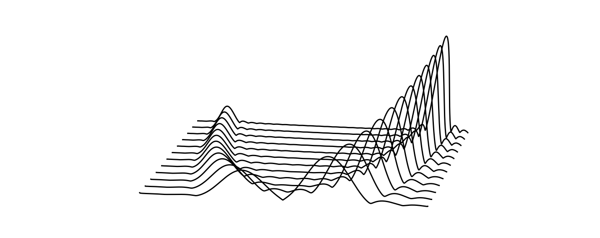

# Hi, I'm Nils 👋

I'm a (soon to be graduated) PhD Student at the International Audio Laboratories Erlangen.

My current research focus are audio signal processing and specifically lapped transforms.

